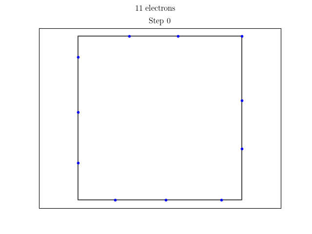

# electron-dance

**electron-dance** is a physics simulation of n charged particles constrained to a square conductor.

The simulation starts with electrons distributed with uniform angle over the square conductor and runs either until
reaching the value of `max-steps` or when two successive simulation steps differ by less than a predefined margin.

Specify the number of particles with option `-n` or `--num-electrons=`.

It is possible to save images of each simulation step to later analyze or just to create neat .gifs.
To save the images, pass the option `-i` or `--images` to the program.

It is also possible to create .gif from the images with the option `-g` or `--gif`. This part depends on `imagemagick`.

Option `-s` will save the last step in a simulation (equillibrium state if the simulation ran for long enough) to a file
for further analysis later.
