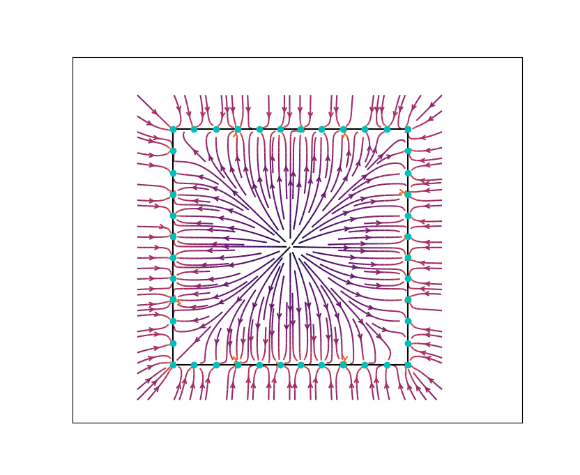
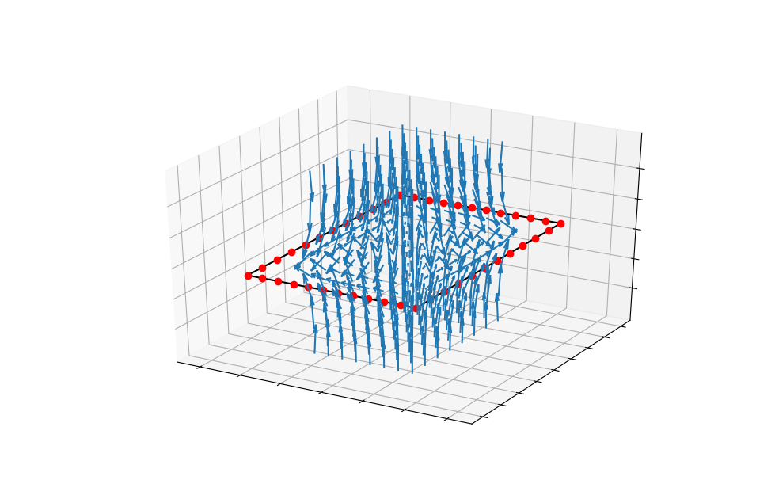

# electron-dance

**electron-dance** is a physics simulation of n charged particles constrained to a square conductor. It was written for an assignment
given at a mathematical physics class.

The simulation starts with electrons distributed with uniform angle over the square conductor and runs either until
reaching the value of `max-steps` or when two successive simulation steps differ by less than a predefined margin.

Specify the number of particles with option `-n` or `--num-electrons=`.

It is possible to save images of each simulation step to later analyze or just to create neat .gifs.
To save the images, pass the option `-i` or `--images` to the program.

It is also possible to create .gif from the images with the option `-g` or `--gif`. This part depends on `imagemagick`. If you
already ran the simulation and saved its images, you can cd into its images directory and run

```
$ convert -delay 4 -loop 0 *.png ../../../gifs/dance.gif
```


By default, the last step in the simulation (the equillibrium state) will be saved to a file so a further analysis can be done.
To prevent this, execute electron-dance with option `-s` or `--no-save-state`.

Alongside **electron-dance**, there is another script. A plotter called **draw-plots**, with which you too can draw
beautiful 3D or 2D plots! Streamplots, contour plots or even 3D quiver plots! Enter following line to draw streamplot below

```
$ ./draw-plots --number=44 --streamplot --color=cyan --big
```



Or execute this `./draw-plots -n 44 -B -3 -C red` to draw a 3D plot representing electric field inside the square.



